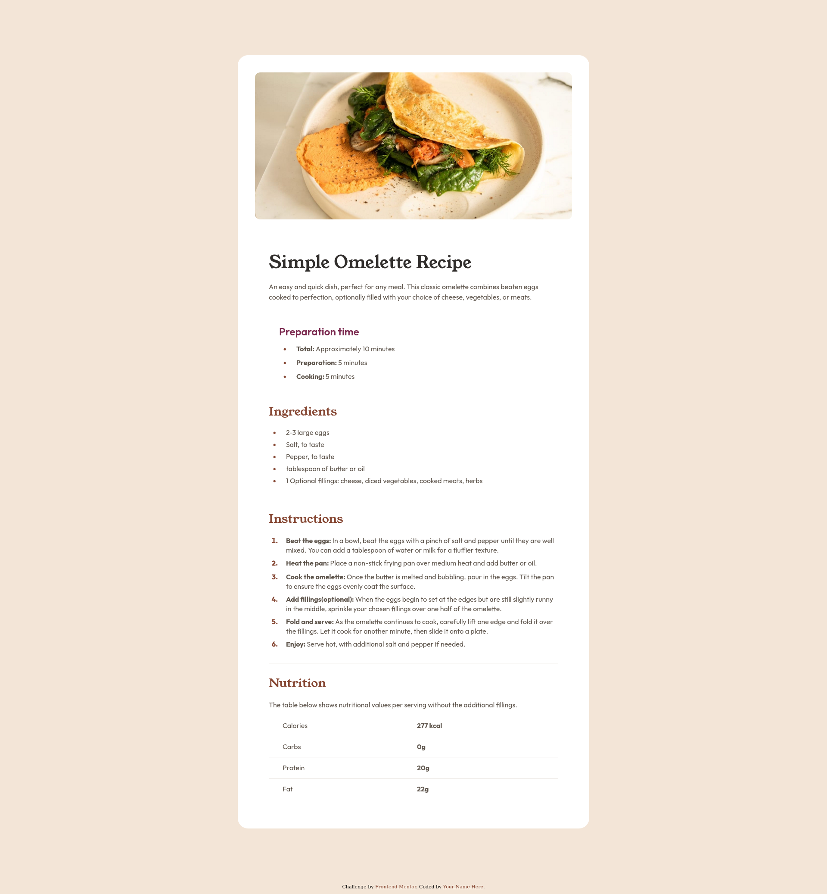

# Frontend Mentor - Recipe page solution

This is a solution to the [Recipe page challenge on Frontend Mentor](https://www.frontendmentor.io/challenges/recipe-page-KiTsR8QQKm). Frontend Mentor challenges help you improve your coding skills by building realistic projects.

## Table of contents

- [Overview](#overview)
  - [The challenge](#the-challenge)
  - [Screenshot](#screenshot)
  - [Links](#links)
- [My process](#my-process)
  - [Built with](#built-with)
  - [What I learned](#what-i-learned)
  - [Continued development](#continued-development)
  - [Useful resources](#useful-resources)
- [Author](#author)
- [Acknowledgments](#acknowledgments)

## Overview

### Screenshot

### Links

- Solution URL: [Recipe Page in GitHub Repo](https://github.com/Yakub357/recipe-page.git)
- Live Site URL: [GitHub Page site](https://yakub357.github.io/recipe-page/)

## My process

### Built with

- Semantic HTML5 markup
- CSS custom properties
- Flexbox
- CSS Grid
- Mobile-first workflow

### What I learned

I learned how to style un-ordered and ordered lists with their css properties, especially what does padding property in List Item do.

### Continued development

I would add more dynamic animations to the website.

### Useful resources

- [Hw to create and style lists with HTML and CSS](https://www.youtube.com/watch?v=bRYwmmLC_Ns&ab_channel=KevinPowell) - Kevin Powell's YouTube channel for deeper understanding CSS for styling web pages. It is helpful to watch this tutorial how to style lists in CSS.

## Author

- Website - [JackEG GitHub](https://github.com/Yakub357)
- Frontend Mentor - [@yourusername](https://www.frontendmentor.io/profile/yourusername)
- Twitter - [@Yakub357](https://www.frontendmentor.io/profile/Yakub357)

## Acknowledgments

Thank you Frontend Team for such organized work.
